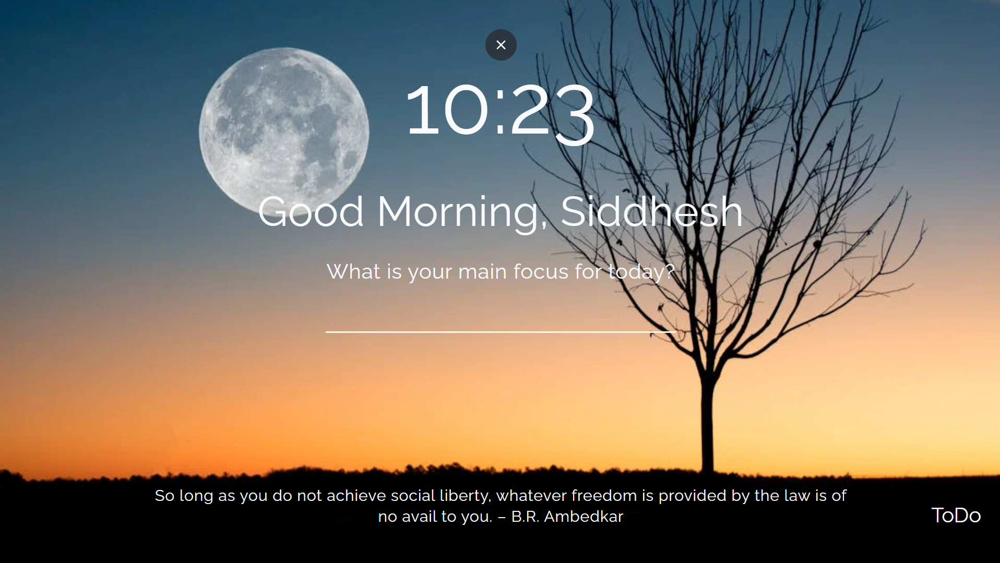
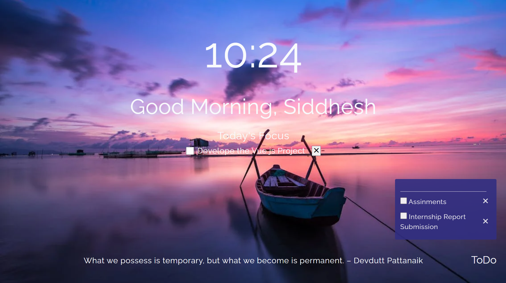
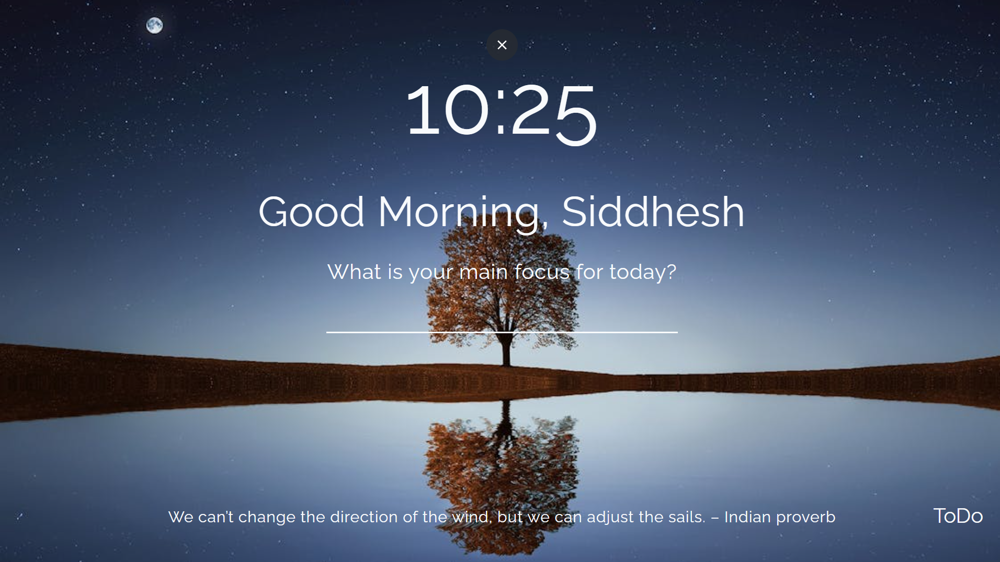

# 🧠 Browser Extension - Daily Focus & Todo List

A sleek and minimalistic Firefox browser extension designed to help users stay productive with a **Daily Focus Message**, a **Persistent Todo List**, and **Refreshing Daily Quotes**. Built using React, Context API, and localStorage.

---

## 🔥 Features

- ✅ Add, delete, and manage a todo list directly in your browser.
- 🕒 Daily **focus message** with personalized context.
- 🧘‍♂️ New **motivational quotes** every day.
- ♻️ Persistent data via `localStorage` – remembers your tasks even after a refresh.
- ⚛️ Context API & useReducer used for efficient state management.

---

## 🚀 Tech Stack

- React.js
- Context API + useReducer
- UUID for unique IDs
- Vite (Build Tool)
- HTML, CSS
- Firebase (for hosting)
- Firefox Extension API

---

## 📁 Project Structure

```bash
browser-extension/
│
├── .firebase/ # Firebase config files
├── dist/ # Build output
├── node_modules/ # Dependencies
├── public/ # Static assets
├── src/ # Source code
│ ├── components/ # Todo and UI components
│ ├── context/ # Browser context API setup
│ ├── reducer/ # Reducer for global state
│ └── App.jsx # Main component
├── index.html
├── package.json
├── vite.config.js
├── firebase.json
├── README.md
```


---

## 🧪 Screenshots

> 📸 Add a screenshot of your extension running in the browser here







---

## 🛠️ Setup Instructions

1. **Clone the repo:**
   ```bash
   git clone https://github.com/your-username/browser-extension.git
   cd browser-extension
```

2. **Install Dependencies:**

   ```bash
   npm install
   ```

3. **Start the Development Server:**

   ```bash
   npm run dev
   ```

4. **Build for Production:**
    ```bash
    npm run build
    ```

5. **Load as Firefox Extension**
    Open Firefox → Extensions → "Load Temporary Add-on"
    Select manifest.json from dist or public folder


#### [🚀 View Live Demo](https://browser-extension-s09t.onrender.com/)
